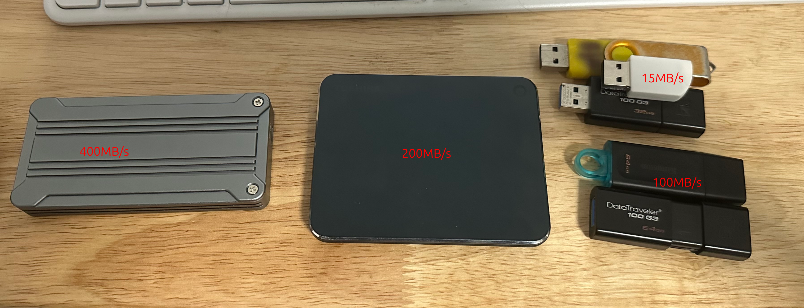

# 硬盘测试

给电脑换固态硬盘，然后把取下来的固态硬盘做U盘，和其他U盘以及电脑中的固态硬盘做了一个速度比较。

大概的测试结果数据是

```bash
# 电脑固态硬盘
zhouhang@ENVY:~$ sudo hdparm -Tt /dev/nvme0n1p2

/dev/nvme0n1p2:
 Timing cached reads:   21108 MB in  1.99 seconds = 10623.21 MB/sec
 Timing buffered disk reads: 6314 MB in  3.00 seconds = 2104.63 MB/sec

# 外接固态硬盘（卸下的固态硬盘做的移动硬盘或者U盘）
zhouhang@ENVY:~$ sudo hdparm -Tt /dev/sda3

/dev/sda3:
 Timing cached reads:   20642 MB in  1.99 seconds = 10387.90 MB/sec
 Timing buffered disk reads: 1328 MB in  3.01 seconds = 441.50 MB/sec


# 购买的固态移动硬盘
zhouhang@ENVY:~$ sudo hdparm -Tt /dev/sda2

/dev/sda2:
 Timing cached reads:   19576 MB in  1.99 seconds = 9848.40 MB/sec
 Timing buffered disk reads: 828 MB in  3.06 seconds = 270.79 MB/sec


# 使用比较少或者比较新的U盘（都是金士顿）
zhouhang@ENVY:~$ sudo hdparm -Tt /dev/sda1

/dev/sda1:
 Timing cached reads:   21660 MB in  1.99 seconds = 10903.87 MB/sec
 Timing buffered disk reads: 310 MB in  3.01 seconds = 102.92 MB/sec


# 比较旧的或者使用比较多的还有一个赠送的U盘
zhouhang@ENVY:~$ sudo hdparm -Tt /dev/sda4

/dev/sda4:
 Timing cached reads:   18522 MB in  1.99 seconds = 9314.94 MB/sec
 Timing buffered disk reads:  42 MB in  3.14 seconds =  13.37 MB/sec
```

然后在测试中也发现了几个值得注意的点：

1. 移动硬盘的连接线会影响速度，一开始我使用买读卡器赠送的标有雷电4的线，结果测出来只有40MB/s，更换为以前移动固态硬盘的线之后速度就涨到了400MB/s多，只能说国产线真垃圾。

2. 在装系统的时候我能明显感受到100MB/s的U盘比10MB/s多的U盘要快太多，大概也是数据上体现出来的差距，总而言之，高速U盘没毛病。

最后来一张全家福


